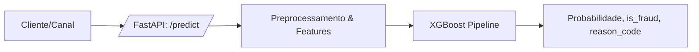

# Risky: Microserviço de Detecção de Fraude em Tempo Real com IA Explicável (<50ms)

API e pipeline fim-a-fim para detectar fraudes financeiras em tempo real usando PaySim, com engenharia de features de domínio, tratamento de desbalanceamento e explicabilidade.

## Problema de negócio
- Fraude é assimétrica: falso positivo gera churn e dano reputacional; falso negativo gera perda direta.  
- Objetivo: maximizar F1/AUPRC equilibrando precisão e recall, entregando motivo claro para analistas.

## Stack
- Python 3.10+, Pandas/Numpy, Scikit-Learn + XGBoost/LightGBM, Imbalanced-Learn, SHAP.
- FastAPI + Pydantic para a API; Docker para deploy; pytest para teste de integração.

## Arquitetura (alto nível)


## Dataset
- Principal: PaySim (Kaggle).  
- Baixe o CSV em `data/paysim.csv` (não versionado).  
- O modelo usa apenas TRANSFER e CASH_OUT (padrão de fraude do dataset).

## Como treinar
```bash
python -m app.train --csv-path data/paysim.csv --artifacts-dir models
```
Saídas: `models/model.joblib`, `models/preprocessor.joblib`, `models/metrics.json`.

## Como rodar a API
Local:
```bash
uvicorn app.main:app --host 0.0.0.0 --port 8000 --reload
```
Docker:
```bash
docker build -t risky-api .
docker run -p 8000:8000 -e RISKY_MODEL_PATH=/app/models/model.joblib -v $(pwd)/models:/app/models risky-api
```

### Exemplo de requisição
```bash
curl -X POST http://localhost:8000/predict \
  -H "Content-Type: application/json" \
  -d '{
    "step": 10,
    "type": "TRANSFER",
    "amount": 12000,
    "nameOrig": "C9000",
    "oldbalanceOrg": 15000,
    "newbalanceOrig": 3000,
    "nameDest": "M5000",
    "oldbalanceDest": 0,
    "newbalanceDest": 12000,
    "isFlaggedFraud": 0
  }'
```
Resposta:
```json
{"fraud_probability": 0.85, "is_fraud": true, "reason_code": "HIGH_AMOUNT"}
```

## Engenharia de features (app/pipeline.py)
- `hour_of_day = step % 24` (fraudes de madrugada).  
- `balance_error_orig/dest = saldo_ant + amount - saldo_novo` (inconsistência de saldo).  
- Flags de conta destino/origem iniciando com `M` (comerciantes).  
- Filtro de tipos de maior risco: TRANSFER e CASH_OUT.

## Modelagem
- Pipeline com `ColumnTransformer` (OneHot + StandardScaler) + XGBClassifier.  
- Desbalanceamento: `scale_pos_weight` calibrado pela razão negativo/positivo.  
- Métricas: F1 e AUPRC (salvas em `models/metrics.json`).  
- Explicabilidade: razão simples (`reason_code`) e gancho para SHAP (modelo é baseado em árvore).

## Testes
```bash
pytest
```
`tests/test_api.py` cria um modelo dummy, injeta via `RISKY_MODEL_PATH` e valida `/predict`.

## Próximos passos (sugestão)
1) Adicionar SHAP Waterfall para casos de fraude salvos em `notebooks/`.  
2) Implementar buffer de transações para feature de velocidade (n transações/última hora).  
3) Incluir docker-compose com Postgres/Redis para rastrear decisões.
