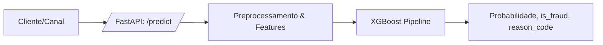

# Risky: API de Detecção de Fraude em Tempo Real com IA Explicável (<50ms)

API e pipeline fim-a-fim para detectar fraudes financeiras em tempo real usando PaySim, com engenharia de features de domínio, tratamento de desbalanceamento e explicabilidade.

## Problema de negócio
- Fraude é assimétrica: falso positivo gera churn e dano reputacional; falso negativo gera prejuízo direto.
- Objetivo: equilibrar Precisão/Recall (F1 e AUPRC), mantendo explicação clara para revisão humana.

## Stack
- Python 3.10+, Pandas/Numpy, Scikit-Learn + XGBoost/LightGBM, Imbalanced-Learn, SHAP (opcional).
- FastAPI + Pydantic para a API; Docker/Docker Compose para deploy; pytest para testes.

## Arquitetura (alto nível)


## Dataset
- Principal: PaySim (Kaggle).
- Coloque o CSV em `data/paysim.csv` (não versionado).
- O modelo é treinado apenas com `TRANSFER` e `CASH_OUT` (padrão de fraude do dataset).

## EDA (Fase 1)
Gera gráficos e calcula **null accuracy** (baseline “tudo legítimo”):
```bash
python notebooks/01_eda.py --csv-path data/paysim.csv --out-dir reports/eda
```

## Treino
```bash
python -m app.train --csv-path data/paysim.csv --artifacts-dir models --reports-dir reports
```
- Artefatos: `models/model.joblib`, `models/preprocessor.joblib`, `models/metrics.json`.
- Relatórios: `reports/confusion_matrix.png`, `reports/pr_curve.png`, `reports/threshold_tuning.csv`.

## Rodar a API
Local:
```bash
uvicorn app.main:app --host 0.0.0.0 --port 8000 --reload
```
Docker:
```bash
docker build -t risky-api .
docker run -p 8000:8000 -e RISKY_MODEL_PATH=/app/models/model.joblib -v $(pwd)/models:/app/models risky-api
```
Docker Compose (1 comando):
```bash
docker compose up --build
```

### Exemplo de requisição
```bash
curl -X POST http://localhost:8000/predict \
  -H "Content-Type: application/json" \
  -d '{
    "step": 10,
    "type": "TRANSFER",
    "amount": 12000,
    "nameOrig": "C9000",
    "oldbalanceOrg": 15000,
    "newbalanceOrig": 3000,
    "nameDest": "M5000",
    "oldbalanceDest": 0,
    "newbalanceDest": 12000,
    "isFlaggedFraud": 0
  }'
```

## Endpoints
- `GET /health` → saúde do serviço.
- `POST /predict` → retorna `fraud_probability`, `is_fraud`, `reason_code` e `threshold`.
- `POST /explain` → retorna contribuições SHAP (quando disponível).

## Engenharia de features (app/pipeline.py)
- Temporais: `hour_of_day = step % 24`.
- Domínio: `balance_error_orig/dest = oldBalance + amount - newBalance`.
- Velocidade (offline): contagem de transações por conta na última 1h (step atual + step anterior).
- Velocidade (online/API): buffer em memória (demo) para `tx_count_*_last_1h`.

## Modelagem
- Pipeline com `ColumnTransformer` (OneHot + StandardScaler) + XGBClassifier.
- Desbalanceamento: `scale_pos_weight` calibrado pela razão negativo/positivo.
- Métricas: F1/AUPRC + **threshold tuning** (salvo como `best_threshold` em `models/metrics.json`).

## Explicabilidade (XAI)
- A API sempre retorna `reason_code` (heurística de negócio).
- O endpoint `/explain` usa SHAP quando o pacote estiver instalado.
- No Windows + Python 3.13, `shap` pode falhar sem build tools; recomenda-se rodar SHAP via Docker (Python 3.11, já suportado).

Para gerar um waterfall SHAP para um caso de fraude:
```bash
python notebooks/02_shap_waterfall.py --csv-path data/paysim.csv --model-path models/model.joblib --out-path reports/shap_waterfall.png
```

## Testes
```bash
pytest
```
Teste de integração (API rodando):
```bash
python scripts/check_api.py
```

## Próximos passos (sugestão)
1) Persistir buffer de velocidade em Redis (produção).
2) Adicionar Postgres/Redis no docker-compose para rastrear decisões e auditoria.
